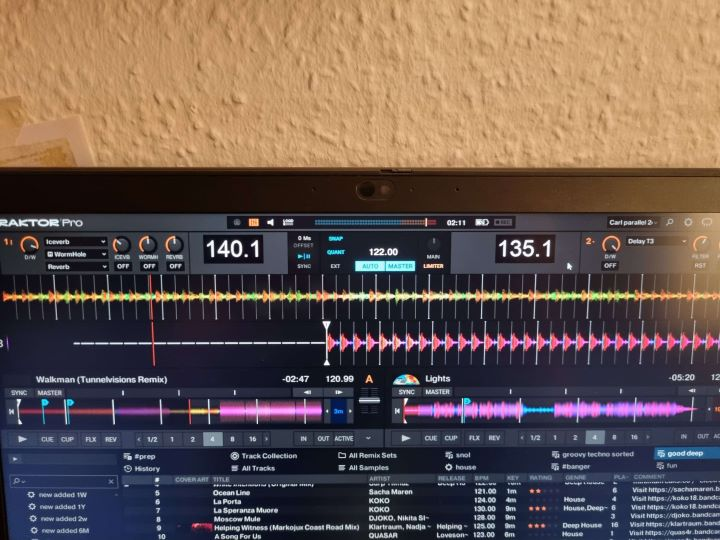

# UNDER DEVELOPMENT. 

Readme might not be updated as much as it should. 

# Live Input BPM Overlay

You can use this to show the BPM of a live input source. For example two record players. It will be always on top



First run it with `--list-devices`

Write those numbers into the `config.json` file plus some coordinates for where it should show up.

If you start the app without any parametes it will read from the config file and should start displaying the BPM for each input on the screen.

## Setup and Installation

### Config

The configuration file for this project is in JSON format. You need to at least have a single input device.

- `input_devices`: 
  - `id`: The ID of the input device. You can find this ID by running the application with the `--list-devices` option.
  - `x`: The x-coordinate on the screen where the input device's data will be displayed.
  - `y`: The y-coordinate on the screen where the input device's data will be displayed.

- `font_size`: The size of the font used to display the BPM on the screen.

- `font_color`: The color of the font used to display the BPM.

- `bg_color`: The color of the background of the displays.

- `bpm_scale` (optional): per-device calibration multiplier to adjust aubio's BPM (default 1.0). Example: `{"id":9, "x":100, "y":100, "bpm_scale": 1.0}`
- `bpm_scale` (optional): per-device calibration multiplier to adjust aubio's BPM (default 1.0). The app now attempts to use the device's default sample rate automatically, which removes the need to tune `bpm_scale` in most cases. Example: `{"id":9, "name":"USB Audio Device","x":100, "y":100, "bpm_scale": 1.0}`

### Windows

You should be able to go into releases and download the .exe file.

Download that to whereever, open a terminal in the same directory and start it there with the `--list-devices` parameter.

Stop with `ctrl` + `c`


### Creating a Virtual Environment (using `uv`)

1. `uv` is expected to be installed already. Create and activate a `uv` environment:

```powershell
uv venv
```

2. Then install Python dependencies inside the environment:

```powershell
uv pip install -r requirements.txt
```

### Installing Packages

Tip: to print raw vs adjusted BPM for calibration, set the env var in PowerShell before running:

```powershell
$env:BPM_DEBUG=1; python .\main.py
```

Settings UI: you can open the settings window on startup to add/remove/configure devices:

```powershell
python .\main.py --settings
```

The settings window stores both `id` and `name` for devices and will try to match devices by name first on subsequent runs so device order is more robust across reboots.

### Building binary

```
pyinstaller --onefile .\main.py
```

Note: the tray icon feature uses `pystray` and `pillow`. When building with PyInstaller, ensure `pystray` and `PIL` are included and bundle any icon assets you use.

## Calibration & manual testing

Quick steps to validate/derive a `bpm_scale` for a device (manual tests):

1. Play a known metronome audio (e.g., 120 BPM) into the target input device.
2. Run with debug output enabled to see raw vs adjusted BPM:

```powershell
$env:BPM_DEBUG=1; python .\main.py
```

3. Observe the `raw=` value printed and compute scale = desired_bpm / mean(raw_bpm).
4. Add `"bpm_scale": <scale>` to the device entry in `config.json` and re-run to verify readings.

Varying `BUFFER_SIZE` (256 → 512) and `window_multiple` (2 → 4) in `main.py` can also affect bias and stability.

### ---

Icon taken from https://iconoir.com
